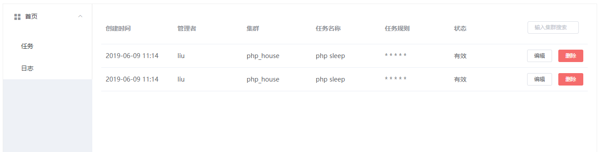

## Demon-IPA

### 1.概述

* Demon-IPA 是几个基于 Swoole 的分布式任务调度系统

* web 界面管理任务 支持任务日志的查看 时刻了解任务执行的状态

* 去中心化，多个 worker pull 的方式抢占消费任务 避免单台机器 down 机导致任务不能执行

* 依赖：Swoole , Redis

### 架构

### 使用

1. 安装Swoole , php-redis 扩展

2. nginx 配置

~~~
server {
        listen 80;
        server_name  km.demon.com;

        root  /mnt/workspace/Demon-IPA;
        index index.html index.htm index.php;
    
        location / {
            if (!-e $request_filename) {
                rewrite ^/(.*)$ /index.php;
            }
        }

        location ~ \.php$ {
            fastcgi_pass   127.0.0.1:9000;
            fastcgi_index  index.php;
            fastcgi_param  SCRIPT_FILENAME  $document_root$fastcgi_script_name;
            include        fastcgi_params;
        }
}

~~~

3.修改Mysql,Redis 配置

```
将根目录中的env.example.php重命名为env.php，并且修改其中的配置
```

4.启动server

```
执行：

php server/jobServer start
```

### 预览



### todo list


1.架构图

2.server 多节点

3.机器负责情况分析

